## Task 2: Create Database and Table in MySQL Server

```sql
CREATE DATABASE website;
```

<figure>
    <figcaption>Task 2-1 Screenshot</figcaption>
    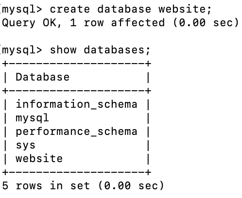
</figure>

```sql
CREATE TABLE website.member (
    id BIGINT AUTO_INCREMENT PRIMARY KEY,
    name VARCHAR(255) NOT NULL,
    username VARCHAR(255) NOT NULL,
    password VARCHAR(255) NOT NULL,
    follower_count INT UNSIGNED NOT NULL DEFAULT 0,
    time DATETIME NOT NULL DEFAULT CURRENT_TIMESTAMP
);
```
<figure>
    <figcaption>Task 2-2 Screenshot</figcaption>
    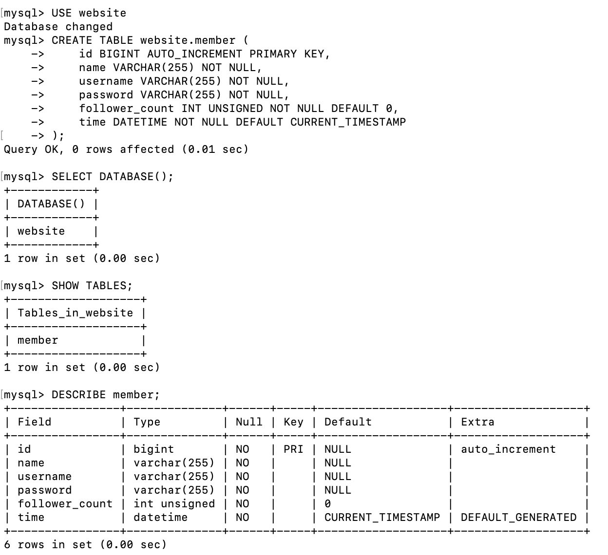
</figure>

### Task 3: SQL CRUD

```sql
INSERT INTO website.member (name, username, password) VALUES ('test', 'test', 'test');
INSERT INTO website.member (name, username, password, follower_count) VALUES ('Mary', 'mary123', 'marySecret123', 1);
INSERT INTO website.member (name, username, password, follower_count) VALUES ('Bob', 'bob456', 'bobSecret456', 2);
INSERT INTO website.member (name, username, password,  follower_count) VALUES ('Amy', 'amy789', 'amySecret789', 3);
INSERT INTO website.member (name, username, password, follower_count) VALUES ('Danny', 'danny000', 'dannySecret000', 4);
```

<figure>
    <figcaption>Task 3-1 Screenshot</figcaption>
    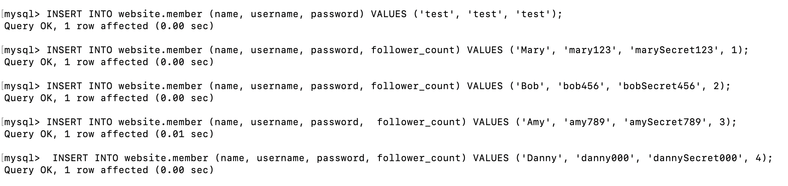
</figure>

```sql
SELECT * FROM website.member;
```

<figure>
    <figcaption>Task 3-2 Screenshot</figcaption>
    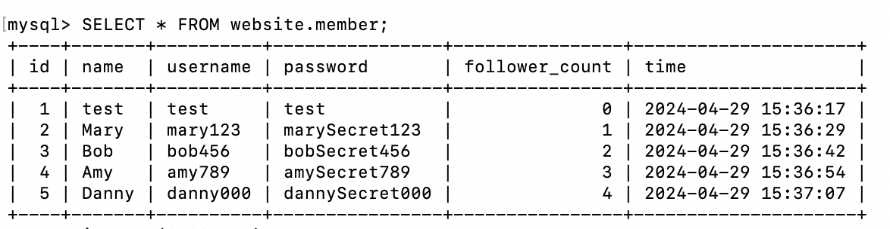
</figure>

```sql
SELECT * FROM website.member ORDER BY time DESC;
```

<figure>
    <figcaption>Task 3-3 Screenshot</figcaption>
    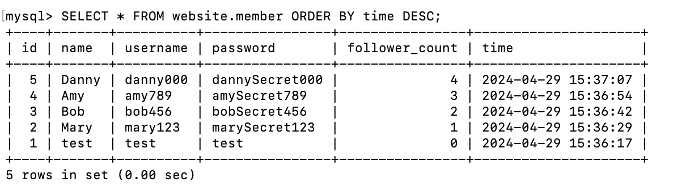
</figure>

```sql
SELECT * FROM website.member ORDER BY time DESC LIMIT 3 OFFSET 1;
```

<figure>
    <figcaption>Task 3-4 Screenshot</figcaption>
    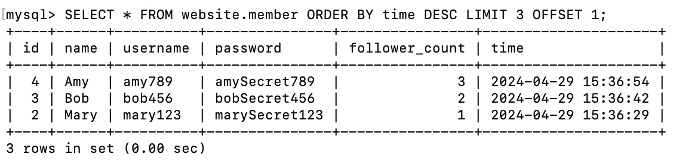
</figure>

```sql
SELECT * FROM website.member WHERE username = 'test';
```

<figure>
    <figcaption>Task 3-5 Screenshot</figcaption>
    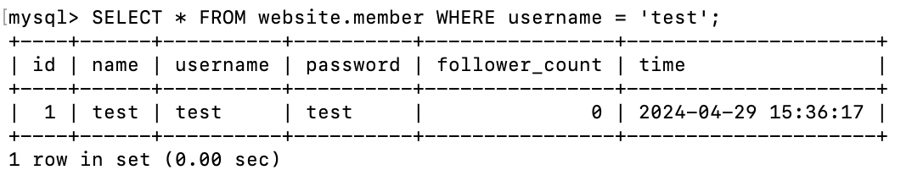
</figure>

```sql
SELECT * FROM website.member WHERE name LIKE '%es%';
```

<figure>
    <figcaption>Task 3-6 Screenshot</figcaption>
    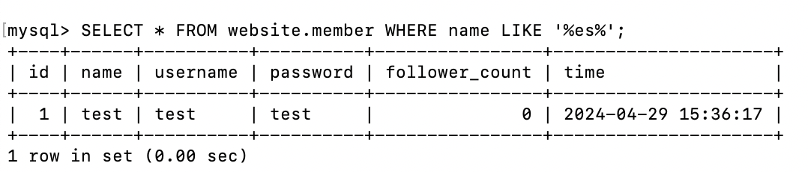
</figure>

```sql
SELECT * FROM website.member WHERE username = 'test' AND password = 'test';
```

<figure>
    <figcaption>Task 3-7 Screenshot</figcaption>
    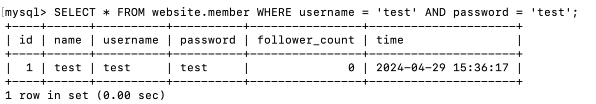
</figure>

```sql
UPDATE website.member SET name = 'test2' WHERE username = 'test';

SELECT * FROM website.member WHERE username = 'test';
```

<figure>
    <figcaption>Task 3-8 Screenshot</figcaption>
    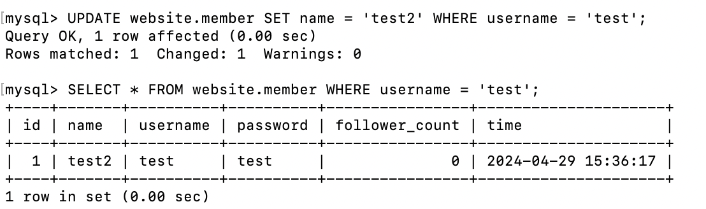
</figure>

### Task 4: SQL Aggregation Functions

```sql
SELECT COUNT(*) FROM website.member;
```

<figure>
    <figcaption>Task 4-1 Screenshot</figcaption>
    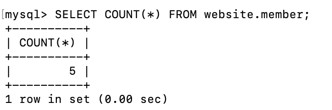
</figure>

```sql
SELECT SUM(follower_count) FROM website.member;
```

<figure>
    <figcaption>Task 4-2 Screenshot</figcaption>
    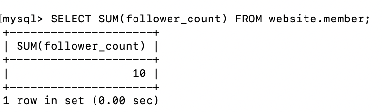
</figure>

```sql
SELECT AVG(follower_count) FROM website.member;
```

<figure>
    <figcaption>Task 4-3 Screenshot</figcaption>
    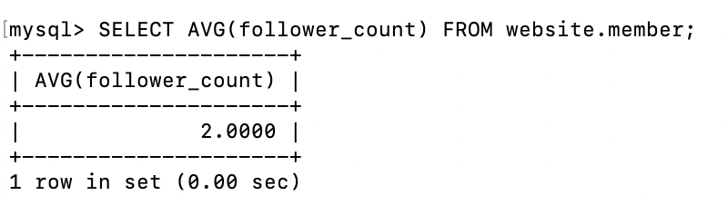
</figure>

```sql
 SELECT AVG(follower_count)  FROM (SELECT follower_count FROM website.member ORDER BY follower_count DESC LIMIT 2) AS top_two_average_followers;
 ```

 <figure>
    <figcaption>Task 4-4 Screenshot</figcaption>
    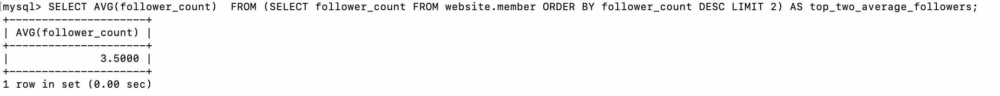
</figure>

### Task 5: SQL JOIN

```sql
CREATE TABLE website.message (
    id BIGINT AUTO_INCREMENT PRIMARY KEY,
    member_id BIGINT NOT NULL,
    content VARCHAR(255) NOT NULL,
    like_count INT UNSIGNED NOT NULL DEFAULT 0,
    time DATETIME NOT NULL DEFAULT CURRENT_TIMESTAMP,
    FOREIGN KEY (member_id) REFERENCES website.member(id)
    );
```

<figure>
    <figcaption>Task 5-1 Screenshot</figcaption>
    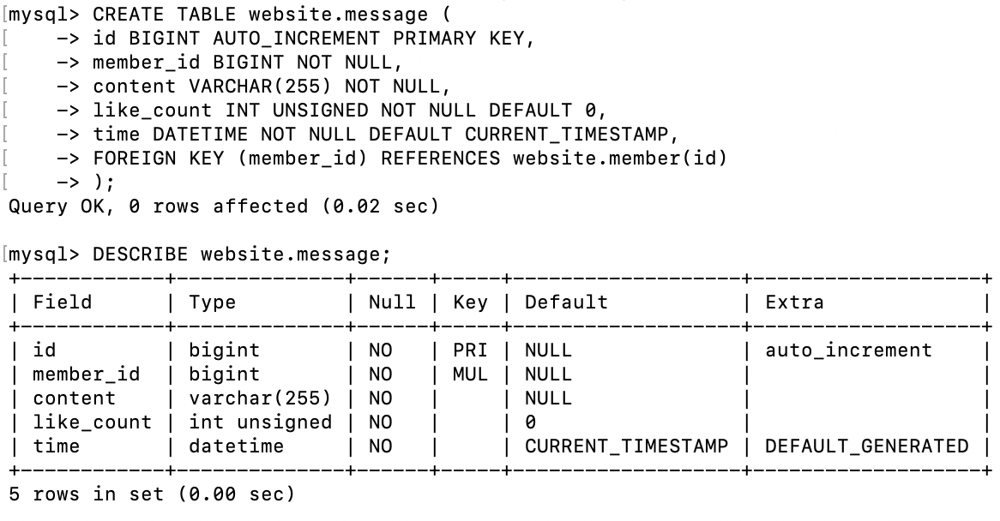
</figure>

```sql
SELECT message.id, member.name AS sender_name, message.content, message.like_count, message.time
FROM website.message
JOIN website.member ON message.member_id = member.id;
```

<figure>
    <figcaption>Task 5-2-1 Screenshot</figcaption>
    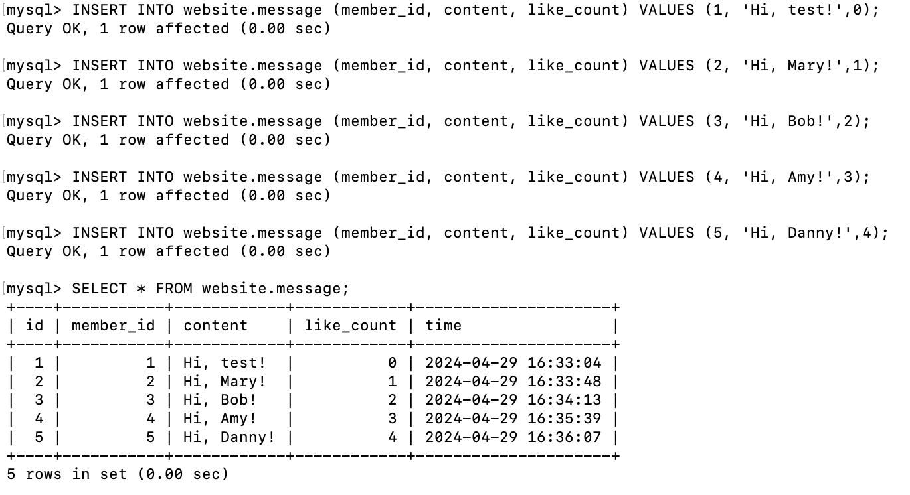
</figure>

<figure>
    <figcaption>Task 5-2-2 Screenshot</figcaption>
    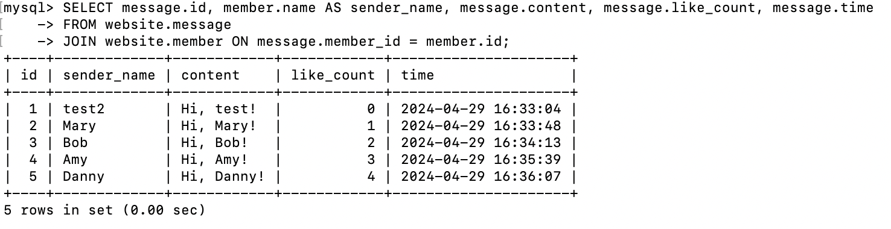
</figure>

```sql
SELECT message.id, member.name AS sender_name, message.content, message.like_count, message.time
FROM website.message
JOIN website.member ON message.member_id = member.id
WHERE member.username = 'test';
```

<figure>
   <figcaption>Task 5-3 Screenshot</figcaption>   
    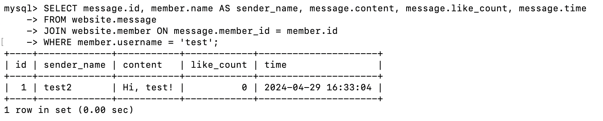

```sql
SELECT AVG(message.like_count) FROM website.message
JOIN website.member ON message.member_id = member.id
WHERE member.username = 'test';
```

<figure>
<figcaption>Task 5-4 Screenshot</figcaption>
    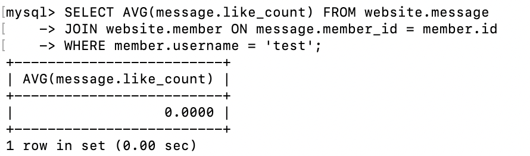
</figure>

```sql
SELECT member.username, AVG(message.like_count) FROM website.message
JOIN website.member ON message.member_id = member.id
GROUP BY member.username;
```

<figure>
    <figcaption>Task 5-5 Screenshot</figcaption>
    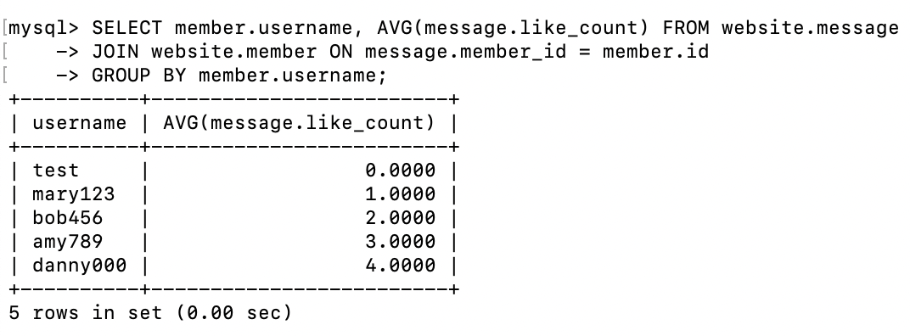
</figure>